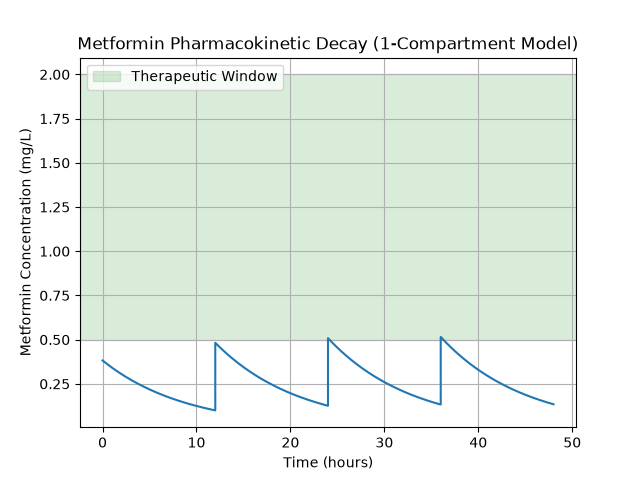

# 1 Compartmental PK Model: Metformin IR

This project utilizies Python to simulate and track blood plasma concentration of Metformin Immediate-Release (IR/Oral Tablet) over a 48-hour period. Built upon a 1-compartmental pharmacokinetic (PK) model, this simulation applies an IV bolus assumption to mathematically model drug distribution and decay. This script specifically analyzes a regimen of the starting dose being 500 mg administered every 12 hours to evaluate drug accumulation against standard clinical therapeutic windows.

# Clinical Context

Metformin is a primary pharmacological treatment for Type 2 Diabetes, but maintaining the correct plasma concentration is critical for patient safety and efficacy:

* Sub-Therapeutic (Too Low): If plasma levels fall below the average therapeutic window (< 0,5 mg/L), the patient experiences inadequate glycemic control, which can lead to hyperglycemia and progressively worse diabetic complications.

* Toxicity (Too High): Excessive accumlation of the drug risks Metformin-Associated Lactic Acidosis (MALA). This is a severe, life threatening medical emergency triggered when blood pH drops below 7.35 and lactic acid levels cross 5 mmol/L.

This computational model visualizes the balance required to keep a patient safely within the established therapeutic window (0.5 - 2.0 mg/L (may depend on conditions))

# The Computational Tools

To accurately model the pharmacokinetics of Metformin progression, this project leveraged Python and standard computing libraries such as:

* Mathematical Modeling: Utilizes 'sciypy.integrate.odeint' to solve the ordinary differential equations (ODE) representing first-order drug elimination.

* Dose Accumulation Logic: Implements a loop structure to simulate repeated dosing intervals, accurately calculating the current drug concentration remaining from previous doses.

* Data Visualization: Uses 'matplotlib.pyplot' to generate a clinical graph, complete with a visual therapeutic window overlay for instant diagnostic feedback and visual cue.

* Automated Clinical Readout: Simple print statements extract and display critical clinical data, specifically the Peak and Trough plasma concentration, directly to the terminal.

# Clinical Findings

 

Running the simulation with the standard 500 mg dose every 12 hours yields the following insights:

* Sub-Therapeutic Maintenance: The peak blood plasma concentration reaches approximately 0.52 mg/L, barely scratching the minimum of the therapeutic window of 0.5 - 2.0 mg/L. The trough concentration drops to 0.10 mg/L, meaning the patient is unmedicated throughout most of the day.

* The Validation of "Starting Dose": This model perfectly shows why 500 mg twice a day is generally prescribed as a starting dose to study tolerance to and adapt to the gastrointestinal system.

* Titration Requirement: To achieve true homeostasis and keep the trough levels safely inside the therapeutic window as regimen advances, the doses must be titrated up to 850 mg ~ 1000 mg twice a day.

# How to Run the Simulation

1. Install Libraries:

Ensure you have Python installed, then install the required scientific libraries by running the following command in a selected terminal:

* MAC/LINUX - `pip3 install numpy scipy matplotlib`
* WINDOWS -`pip install numpy scipy matplotlib`

2. Execute the Script:

Run the Python file from your terminal to view the readout listed on the terminal and to generate the graph:

* MAC/LINUX - `python3 metformin_pk_model.py`
* WINDOWS - `python metformin_pk_model.py`

3. Adjusting Parameters: 

To simulate different patient regimens, open `metformin_pk_model.py` and proceed to modify the `dose_mg` and `dosing_interval` variables.

# References

* [Long-Acting Metformin Vs. Metformin Immediate Release in Patients With Type 2 Diabetes: A Systematic Review](https://pmc.ncbi.nlm.nih.gov/articles/PMC8165304/) - Provided clinical context on the pharmacokinetic differences between Immediate Release (IR) and Extended Release (ER) forms.

* [Metformin dosage](https://www.medicalnewstoday.com/articles/metformin-dosage#overdose) - Used to determine standard clinical starting doses and titration schedules to build regimen parameters.

* [How Long Does Metformin Stay in Your System? Plus, 5 Other Things to Know About Metformin](https://www.goodrx.com/metformin/how-metformin-works-faqs#:~:text=Metformin%20typically%20stays%20in%20your,life%20is%20about%2017%20hours.) - Used to establish the baseline half-life and estimate the elimination rate constant for the 1-compartment decay model.

* [Metformin](https://www.ncbi.nlm.nih.gov/books/NBK518983/) - Verified foundational therapeutic window range and various elimination pathways and procedures.

* [Glumetza ™, 500 mg (metformin hydrochloride extended release tablets) tablet, film coated,
extended release](https://www.accessdata.fda.gov/drugsatfda_docs/label/2006/021748s002lbl.pdf) - Referenced for official regulatory data regarding peak and trough blood plasma concentration rates.

* [Mechanism of Metformin: A Tale of Two Sites](https://diabetesjournals.org/care/article/39/2/187/37215/Mechanism-of-Metformin-A-Tale-of-Two-Sites?__cf_chl_f_tk=a3FpIDXqVqV9GPMPo9YaRqM6DUQr6fCRZOgYuHTFYhc-1783061338-1.0.1.1-PdDZMH3A2ykSGsLdRMO7OEl75TSTfDuqq3xdedDZwzg) - Provided information about biological mechanism of action, specifically detailing gastrointestinal absorption and systemic circulation of the drug.